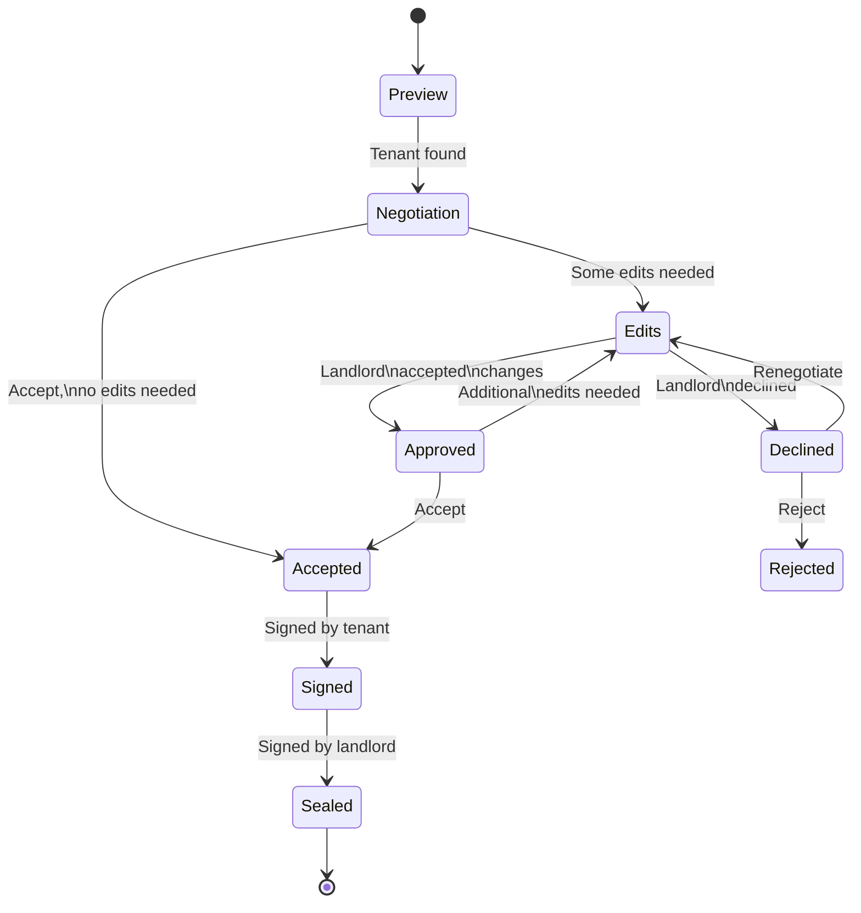

# egghead-rental-negotiation
In this course we'll be building a software for negotiating rental aggreements between Landlord & Tenants, with ability to sign and download final PDF.

## Technologies

Our goal is to compare final project in 4 stacks:
- Next.JS
- Solid.JS
- Svelte
- Astro

We are going to be building this on top of Firebase for simplicity sake.
For css we are going to use TailwindCSS.

## Rental agreement State flow

Rental Aggrement is a document created by the 

